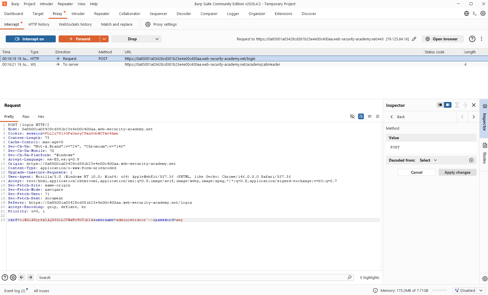
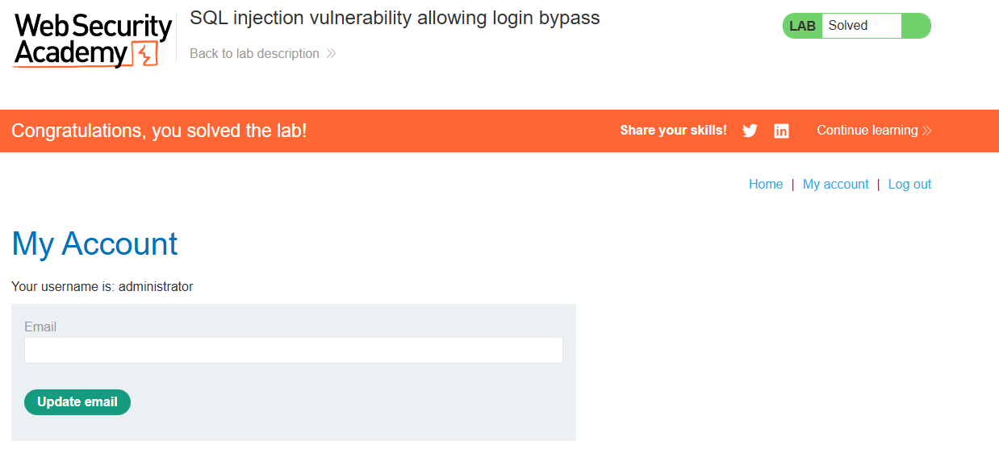

# 💉 SQL Injection Login Bypass (Authentication Evasion)

## 🧠 Core Logical Mechanism (The "Why")
* **Definition:** A vulnerability that occurs when an application authenticates users by directly concatenating credentials into an SQL query string instead of utilizing isolated input handling.
* **Design Flaw:** The application structure allows user-supplied data from form inputs to alter the execution logic of the query, enabling attackers to short-circuit the conditional statements required for successful authentication.

---

## 🛠️ Common Attack Vectors & Payloads
* `administrator'--` -> Forces the database engine to isolate the username and comment out downstream logic, completely evading the password check.
* `admin' OR '1'='1` -> Explores logical tautologies within form inputs to evaluate the conditional authentication statement as true, often returning the first administrative record.

---

## 🔬 Payload Analysis: `administrator'--`
Behind the application, a vulnerable authentication query might look like this:
```sql
SELECT * FROM users WHERE username = 'USER_INPUT' AND password = 'PASSWORD_INPUT';
````

When injecting `administrator'--`, the query breaks down logically as follows:

1. **The Single Quote (`'`):** Prematurely closes the developer's intended string literal for the username field, isolating the target account name (`'administrator'`).
    
2. **The Comment Dash (`--`):** Instructs the database engine to treat everything following it as a comment, effectively neutralizing the rest of the original query structure (`' AND password = 'PASSWORD_INPUT';`). This removes the password requirement entirely from the execution path.
    

## 🧪 Completed Laboratories (PortSwigger)

### Lab 2: SQL Injection Vulnerability Allowing Login Bypass

- **Objective:** Log into the application as the administrator user without knowing their password by exploiting a SQL injection vulnerability in the login form.
    
- **Methodology & Payloads:**
    
    1. Navigated to the authentication interface under the "My Account" section.
        
    2. Intercepted the login attempt via Burp Suite and identified the parameters within the POST request body.
        
    3. Appended the payload `administrator'--` directly into the `username` parameter field, while leaving the password field blank (or filled with a dummy string).
        
    4. The back-end database executed the query, verifying only the existence of the username 'administrator' and ignoring the password condition entirely, successfully granting administrative session access.
        

## 🧠 Technical Insight: Authentication Short-Circuiting

- **Username Field Context:** Highly vulnerable if placed first within the SQL syntax. Introducing a comment character here cuts off the execution flow early, wiping out any subsequent logic or checks (such as the password validation clause).
    
- **Password Field Context:** Injecting comments here is typically ineffective for bypassing authentication because the upstream username condition must still resolve to a valid and true record before the comment truncates the remaining syntax.
    

## 📸 Evidence / Flag

- **Final Payload:**

	
	- Using Burp Suite :   **administrator'--&password=any;**
	
	    
	    
	 - Using the Input text Username adding at the end  `" '-- " `, and setting a random password just to pass the validation
	 
    
- **Screenshots/Notes:**
    

## 🛡️ Defensive Mitigations (Secure Coding)

- **Defensive Standard:** Implement Parameterized Queries (Prepared Statements) for all authentication mechanisms. This guarantees the SQL interpreter treats both username and password inputs strictly as data literals, rendering it impossible to manipulate the logic or structure of the query.