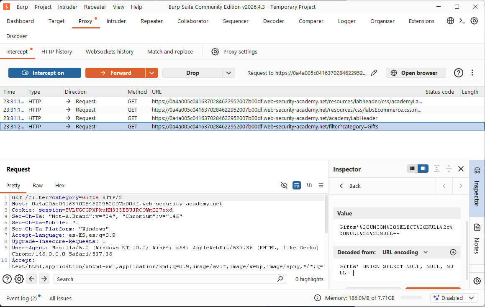
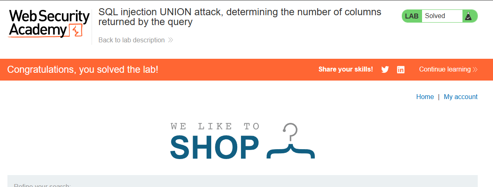
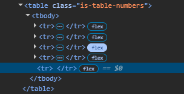

# 💉 UNION SQL Injection (Column Determination)

## 🧠 Core Logical Mechanism (The "Why")
* **Definition:** A technique that leverages the `UNION` operator to append the results of a malicious SQL query to the results of the application's original query.
* **Design Flaw:** The application fails to sanitize input within a query that displays multi-column results, allowing an attacker to execute adjacent queries. 
* **The UNION Constraint:** For a `UNION` attack to succeed, the injected query must return the **exact same number of columns** as the original query, and the data types must be compatible.

---

## 🛠️ Common Attack Vectors & Payloads
* `' ORDER BY 1--` -> Increments the column index to find the exact point where the database throws an error (determining total columns).
* `' UNION SELECT NULL, NULL--` -> Injects an increasing number of `NULL` values until the query executes successfully without a database error.

---

## 🔬 Payload Analysis: `' ORDER BY X--` / `' UNION SELECT NULL--`
Behind the application, a vulnerable product filter query might look like this:
```sql
SELECT name, description, price FROM products WHERE category = 'USER_INPUT';
````

When injecting column-determination payloads, the execution paths behave as follows:

### Method A: The `ORDER BY` Technique

1. `' ORDER BY 1--` -> Works because column 1 exists (`name`).
    
2. `' ORDER BY 3--` -> Works because column 3 exists (`price`).
    
3. `' ORDER BY 4--` -> **Fails / Throws Error** because there is no 4th column. The last successful number tells you the exact column count (3).
    

### Method B: The `NULL` Injection Technique

1. `' UNION SELECT NULL--` -> **Fails** (Column count mismatch).
    
2. `' UNION SELECT NULL, NULL--` -> **Fails** (Column count mismatch).
    
3. `' UNION SELECT NULL, NULL, NULL--` -> **Succeeds!** (Matches the 3 required columns perfectly without triggering type mismatch errors, since `NULL` fits into any data type).
    

## 🧪 Completed Laboratories (PortSwigger)

### Lab 3: SQL injection UNION attack, determining the number of columns returned by the query

- **Objective:** Determine the number of columns returned by a vulnerable query in a product category filter using a UNION attack.
    
- **Methodology & Payloads:**
    
    1. Access the product catalog and select a specific category filter to isolate the vulnerable string parameter in the URL.
        
    2. Send the request to Burp Suite Repeater to closely analyze the response behaviors.
        
    3. Methodically inject an increasing count of `NULL` fields (or increment an `ORDER BY` clause) until the application returns a standard `200 OK` status instead of a database crash or error.
        
    4. Identify the exact number of columns required to proceed with data exfiltration.
        

## 🧠 Technical Insight: Why Use `NULL`?

- **Data Type Neutrality:** When maping columns with `UNION`, databases often enforce strict type matching (e.g., you cannot place a string in an integer column). Specifying `NULL` bypasses this layer of defense entirely during the initial enumeration phase, because `NULL` is considered a valid placeholder value for every single data type (Strings, Integers, Dates, etc.).
    
## 📸 Evidence / Flag

- **Final Payload:** `' UNION SELECT NULL, NULL, NULL--` (Determined exactly 3 columns). 

* **Screenshots / Notes:** 
	* First, we set the malicious payload inside the parameter after capturing the `GET` request using **Burp Suite Proxy/Repeater**: 
	
		
		
		
	* After executing the successful exploit, we can inspect the DOM inside the browser's developer tools to verify the backend behavior. We can clearly see in the code how the table now renders an **additional empty row** (`<tr></tr>`), confirming the database successfully processed the three `NULL` values:
		
		
		


## 🛡️ Defensive Mitigations (Secure Coding)

- **Defensive Standard:** Enforce strict Parameterized Queries (Prepared Statements). Additionally, minimize the exposure of detailed database error messages to end-users, as structural anomalies (like `ORDER BY` errors) provide immediate structural blueprints to external attackers.