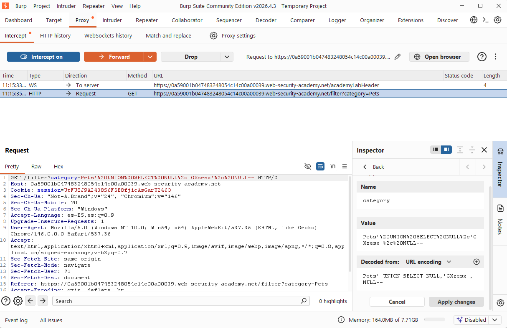
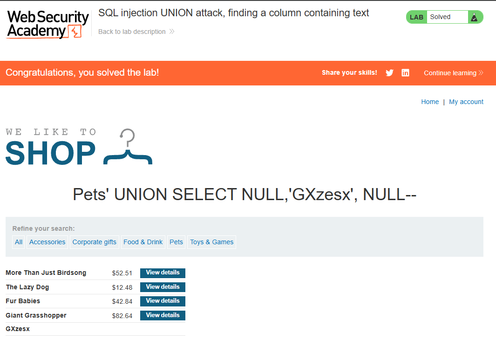

# 💉 UNION SQL Injection (Data Type Probing)

## 🧠 Core Logical Mechanism (The "Why")
* **Definition:** A technique used to identify which columns returned by a vulnerable query are capable of holding string data (character data types like `VARCHAR` or `TEXT`).
* **Design Flaw:** The application blindly appends user input via a `UNION` operator without verifying if the requested rows match the strict data type constraints established in the database schema.
* **The Type Constraint:** SQL databases strictly enforce that data types in corresponding columns of a `UNION` query must be compatible. Trying to inject text into an integer column causes a database exception (`Type Mismatch`).

---

## 🛠️ Common Attack Vectors & Payloads
* `' UNION SELECT 'a', NULL, NULL--` -> Tests if the first column can accept a string literal.
* `' UNION SELECT NULL, 'a', NULL--` -> Tests if the second column can accept a string literal.
* `' UNION SELECT NULL, NULL, 'a'--` -> Tests if the third column can accept a string literal.

---

## 🔬 Payload Analysis: `' UNION SELECT NULL, 'PROBE_STRING', NULL--`
Behind the application, a vulnerable query might look like this:
```sql
SELECT id, name, price FROM products WHERE category = 'USER_INPUT';
````

When systematically replacing `NULL` placeholders with a string value (`'PROBE_STRING'`), the database reacts as follows:

1. **Injected Query:**
    
    SQL
    
    ```
    SELECT id, name, price FROM products WHERE category = 'Gifts' UNION SELECT NULL, 'PROBE_STRING', NULL--';
    ```
    
2. **Column Matching Evaluation:**
    
    - Column 1 (`id`): Receives `NULL` -> Valid (Compatible with integers).
        
    - Column 2 (`name`): Receives `'PROBE_STRING'` -> **Succeeds!** (Both are text data types).
        
    - Column 3 (`price`): Receives `NULL` -> Valid (Compatible with floats/integers).
        
3. **Result:** The application returns an `HTTP 200 OK` status and renders the string literal directly on the screen, revealing that Column 2 is safe for data exfiltration.
    

## 🧪 Completed Laboratories (PortSwigger)

### Lab 4: SQL injection UNION attack, finding a column containing text

- **Objective:** Find the column that accepts text data by injecting a specific string provided by the lab into a multi-column query.
    
- **Methodology & Payloads:**
    
    1. Determine the column count using the previous `NULL` mapping technique (or an `ORDER BY` routine).
        
    2. Isolate the traffic inside Burp Suite Repeater.
        
    3. Systematically replace each `NULL` placeholder one at a time with the target string literal provided by PortSwigger.
        
    4. Analyze the server response codes; look for the payload permutation that resolves successfully without throwing an Internal Server Error (`500`).
        
    5. Verify that the target string is successfully rendered back into the webpage UI.
        

## 🧠 Technical Insight: Strict Schema Type Enforcement

- **Strongly Typed Databases:** Oracle, PostgreSQL, and SQL Server are extremely strict regarding data type safety. Unlike SQLite or MySQL (which can sometimes be more forgiving with implicit type conversions), a strict database engine will immediately crash the entire transaction if it encounters a data type collision, making systematic `NULL` probing an essential defensive bypass strategy.
    

## 📸 Evidence / Flag


* **Target String Provided:** `GXzesx` 
* **Final Payload:** `' UNION SELECT NULL, 'GXzesx', NULL--` 

* **Screenshots / Notes:** 
	* First, we captured the vulnerable `GET` request using **Burp Suite Proxy/Repeater** and injected the malicious payload into the category filter parameter to probe the second column: 
		
	
	
	* After executing the successful exploit, the database processed the query without errors. We can verify that the second column safely accepts character data, as the application renders an additional row reflecting the provided string literal (`GXzesx`) directly within the webpage UI:
		

## 🛡️ Defensive Mitigations (Secure Coding)

- **Defensive Standard:** Enforce strongly parameterized inputs (Prepared Statements). Since parameterized inputs separate the query structure from the data literal, the database interpreter never attempts to evaluate or cast user input as part of an ad-hoc `UNION` table construct.