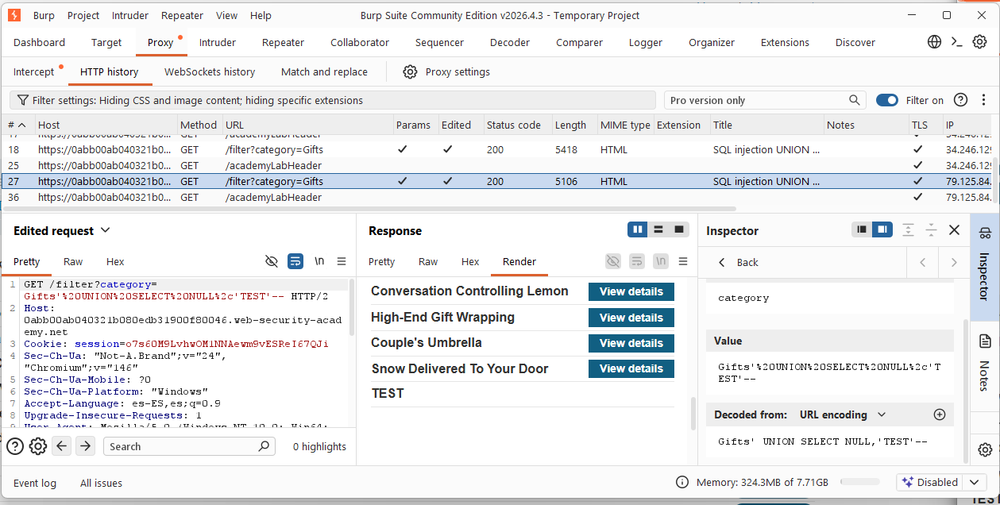
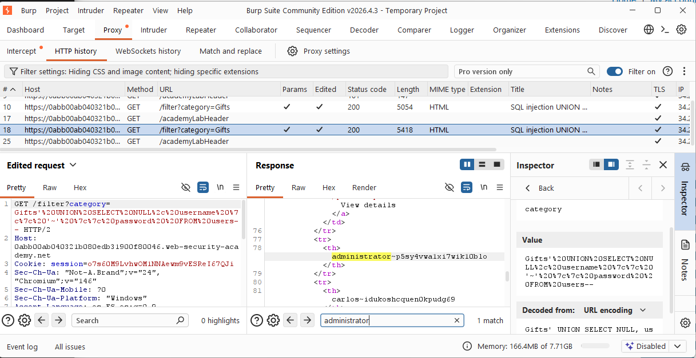
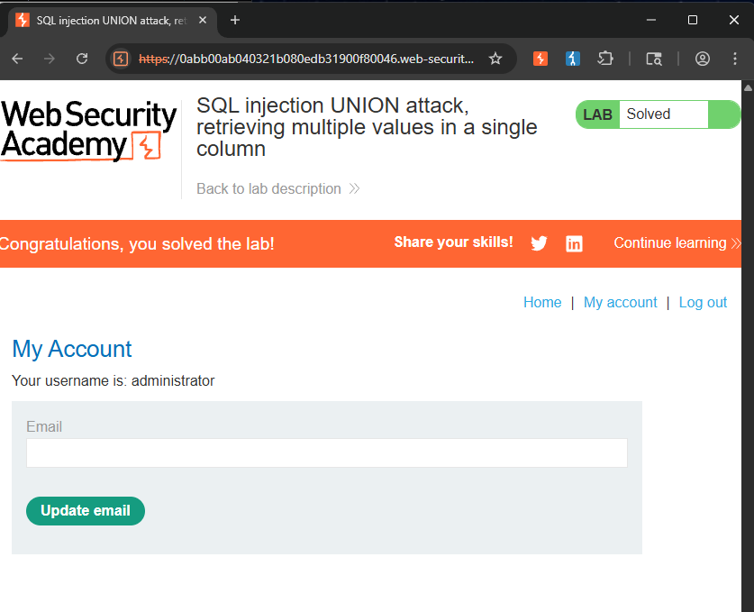

# 💉 UNION SQL Injection (Single-Column Data Aggregation)

## 🧠 Core Logical Mechanism (The "Why")
* **Definition:** An exploitation technique used when structural constraints limit data extraction to a single data point. The attacker combines multiple target attributes into a single string expression to exfiltrate complex records through a single text-compatible column.
* **Design Flaw:** The application restricts its UI presentation layer to map only one specific field from the database query, but fails to prevent data aggregation functions within the SQL parser context.

---

## 🛠️ Common Attack Vectors & Payloads
* `' UNION SELECT username || '~' || password FROM users--` (If column count is 1)
* `' UNION SELECT NULL, username || ':' || password, NULL FROM users--` (If column count is 3, but only the second column accepts text)

---

## 🔬 Payload Analysis: `' UNION SELECT NULL, username || '~' || password FROM users--`
Behind the application, the database processes the injection by executing an explicit string concatenation routine:

1. **Column Constraining:** The `NULL` placeholders align the query's shape, ensuring that only the specific index designated as a text field handles the data payload.
2. **String Aggregation:** The database engine scans the `users` table row-by-row. Instead of returning multiple values, it executes an inline concatenation (e.g., `username + separator + password`), merging distinct logical entities into a single string object.
3. **Delimiter Tracking:** The usage of a custom delimiter like `~` or `:` is critical. It ensures the auditor can programmatically or visually bisect the output string back into its original component values (`username` and `password`).

---

## 🧪 Completed Laboratories (PortSwigger)
### Lab 6: SQL injection UNION attack, retrieving multiple values in a single column
* **Objective:** Exploit the SQL injection vulnerability in the product category filter to retrieve usernames and passwords from the `users` table, concatenate them using a specific delimiter, and log in as the administrator.
* **Methodology & Payloads:**
  1. Determine the column count and isolate which single column allows string/text types.
  2. Craft a concatenation payload tailored to the underlying database dialect (e.g., using `||` or `CONCAT()`).
  3. Inject the payload into the category parameter and analyze the unified string output.
  4. Isolate the administrator's password by splitting the string at the designated delimiter.
  5. Authenticate into the administrative panel to complete the challenge.

---

## 🧠 Technical Insight: Delimiter Selection
* When exfiltrating aggregated strings, pick rare or non-alphanumeric delimiters (e.g., `~`, `|`, `:::`, `$` ). If you use a common character like a space or a simple hyphen, and the password itself contains that character, parsing the credentials accurately during the data-processing phase becomes significantly more complex.

---

## 📸 Evidence / Flag

* **Target Exploitation Payload:** `' UNION SELECT NULL, username || '~' || password FROM users--` 

* **Extracted Administrative Credentials:** 
	* **Username:** `administrator` 
	* **Password:** `p5sy4vwa1xi7wik10blo` 
	
	* **Screenshots / Notes:**
		  * Identifying the single text-compatible column via Burp Suite Repeater, using the word "TEST":
		  
    
		* Extracting the concatenated string (`admin~password`) from the HTML response:
		  
			
			
---

## 🛡️ Defensive Mitigations (Secure Coding)
* **Defensive Standard:** Enforce strict Parameterized Queries (Prepared Statements). Ensure that the database driver strictly binds input strings as literals rather than executable query expressions, nullifying any attempts to execute data manipulation or aggregation functions inside the parameters.