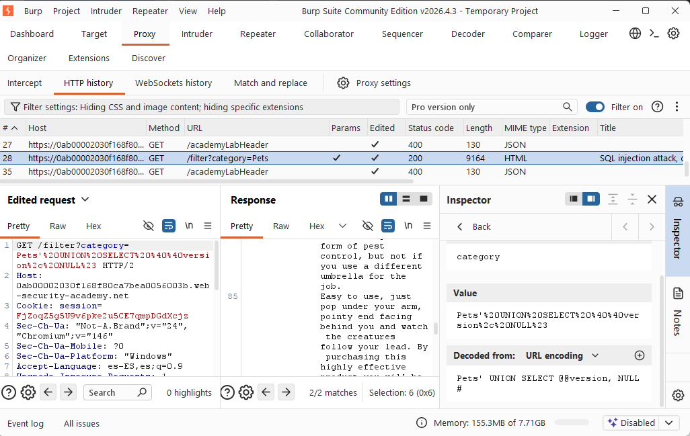
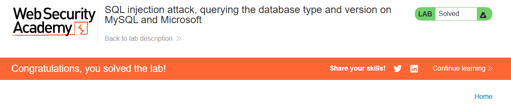

---
tags:
  - web-security
  - sqli
  - portswigger-academy
  - database-fingerprinting
  - mysql
  - mssql
date: 2026-06-28
status: Completed
---

# 💉 SQL Injection - Database Fingerprinting (MySQL & MSSQL)

## 🧠 Core Logical Mechanism (The "Why")
* **Definition:** Database fingerprinting allows an attacker to identify the database type and version. This is critical for tailoring subsequent payloads (e.g., locating specific system tables or known vulnerabilities).
* **Syntax Commonalities:** Both Microsoft SQL Server (MSSQL) and MySQL store their version string in the global variable `@@version`.
* **The Crucial Difference (Comments):**
  * **Microsoft (MSSQL):** Uses standard `--` to comment out the rest of the query.
  * **MySQL:** A double-dash **MUST** be followed by a space (`-- `). In a URL query string, this space must be encoded as a plus sign (`--+`) or URL-encoded (`--%20`). Alternatively, MySQL accepts the hash symbol (`#`).

---

## 🛠️ Attack Vectors & Payloads

### Microsoft (MSSQL) Environment
* **Structure Probing:** `' UNION SELECT NULL, NULL--`
* **Version Extraction:** `' UNION SELECT @@version, NULL--`

### MySQL Environment
* **Structure Probing:** `' UNION SELECT NULL, NULL#`  *or* `' UNION SELECT NULL, NULL--+`
* **Version Extraction:** `' UNION SELECT @@version, NULL#`  *or* `' UNION SELECT @@version, NULL--+`

---

## 🧪 Completed Laboratories (PortSwigger)
### Lab 7: SQL injection attack, querying the database type and version on MySQL and Microsoft
* **Objective:** Determine which of the two databases is running behind the category filter and display its software version string.
* **Methodology:**
  1. Determine the column count using `' ORDER BY X--+` or `' ORDER BY X#`.
  2. Locate the column that accepts string data using placeholders.
  3. Replace the text-compatible placeholder with `@@version`.
  4. Inspect the application response or rendered page to retrieve the version flag.

---

## 📸 Evidence / Flag
* **Target Exploitation Payload:**   `Pets' UNION SELECT @@version, NULL#
* **Extracted DBMS Version Details:**  8.0.42-0ubuntu0.20.04.1
* **Screenshots / Notes:**
  * Identifying the active database and retrieving the version string:
	  * 
	*  

---

## 🛡️ Defensive Mitigations
* **Remediation:** Enforce parameterized queries (Prepared Statements) to entirely separate the user input from the SQL execution logic. Ensure all database layers utilize context-aware input validation.