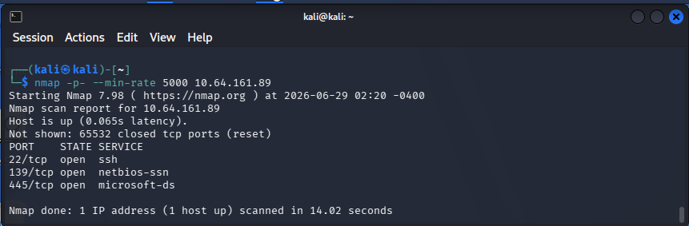
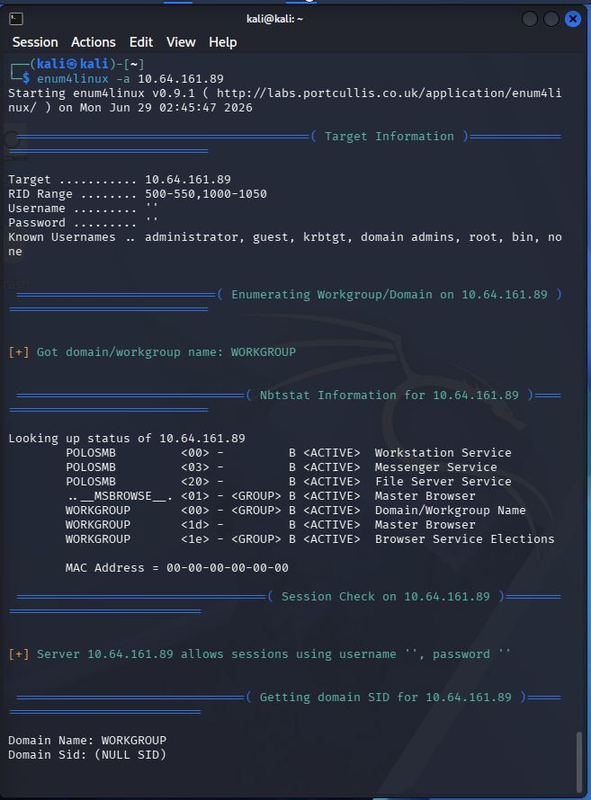
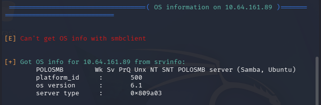
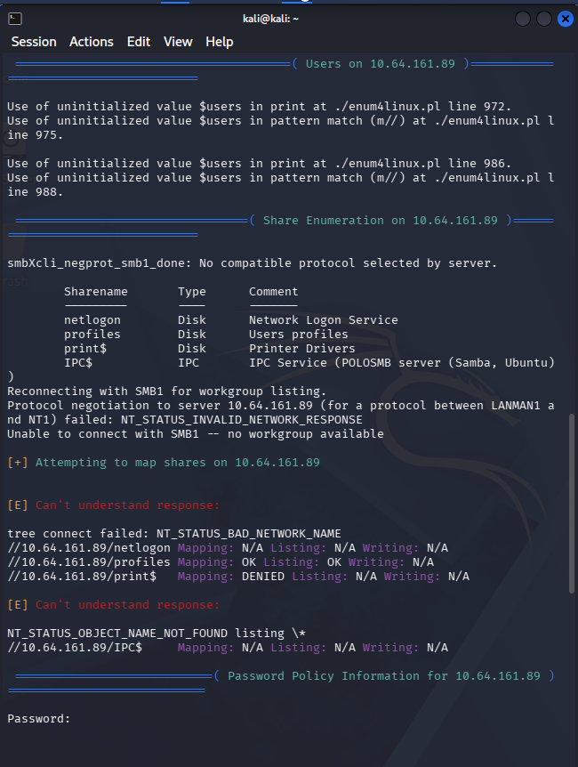
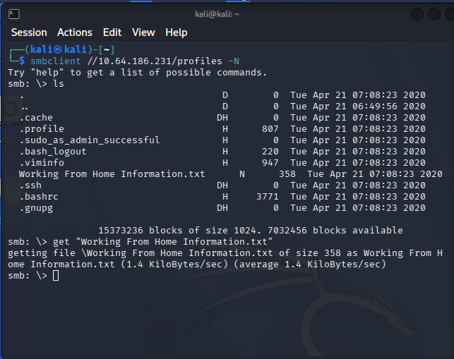
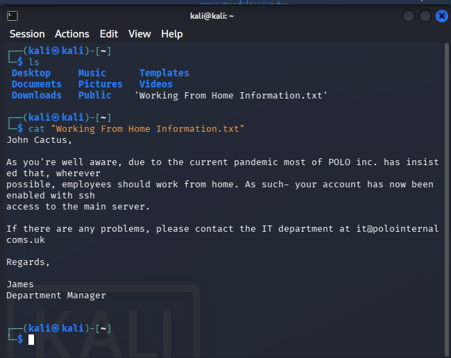
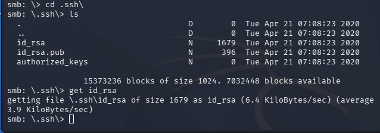
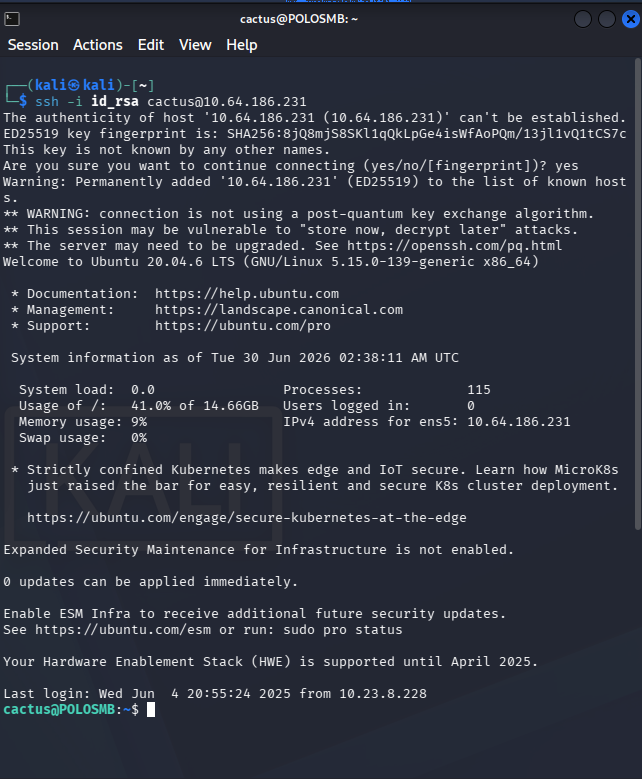
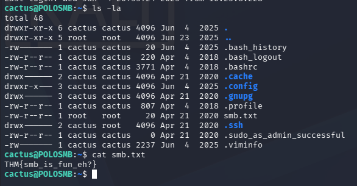

---
tags:
  - network-security
  - infrastructure
  - smb
  - samba
  - tryhackme
  - enumeration
date: 2026-06-28
status: Completed
---
# 🌐 SMB / Samba Enumeration & Exploitation

## 🧠 Core Logical Mechanism (The "Why")
* **Protocol Definition:** Server Message Block (SMB) is a network file-sharing protocol that allows applications on a computer to read and write to files and request services from server programs in a computer network.
* **Samba:** The open-source Linux implementation of SMB, bridging interoperability between Unix/Linux environments and Windows systems.
* **The Attack Surface:** Misconfigured SMB shares often allow Anonymous Logins or guest access without authentication, exposing sensitive files, source code, or configuration credentials to the network.

---

## 🛠️ Infrastructure Reconnaissance Commands

### 1. Port Scanning & Service Fingerprinting
```bash
# Scan target for open SMB ports (139/445) and extract running version
nmap -p 139,445 -sV -sC <TARGET_IP>

# Full aggressive port sweep (65535 ports) at high speed
nmap -p- --min-rate 5000 <TARGET_IP>
````

### 2. Comprehensive Automated Enumeration

```Bash
# Run full basic enumeration targeting users, shares, and OS details
enum4linux -a <TARGET_IP>
```

### 3. Share Enumeration & Connection (Anonymous Access Check)

```Bash
# List available shares anonymously
smbclient -L //<TARGET_IP>/ -N

# Connect to a specific shared folder without a password
smbclient //<TARGET_IP>/<SHARE_NAME> -N
```

> 📌 _Note: The `-N` flag instructs the client to suppress the password prompt (No password)._

## 🔍 SMB Enumeration via Enum4Linux (Lab Findings)

We executed an automated interrogation sweep against the active target to extract internal NetBIOS and architecture configurations.

- **Target IP Address:** `10.64.186.231`
    
- **Workgroup/Domain Name:** `WORKGROUP`
    
- **Machine Name (NetBIOS):** `POLOSMB3`
    
- **Operating System Platform:** Linux (Samba Server on Ubuntu)
    

### 📂 Discovered Network Shares

The enumeration tool successfully mapped the following directory entry points:

|**Sharename**|**Type**|**Comment**|**Security Assessment**|
|---|---|---|---|
|`netlogon`|Disk|Network Logon Service|Standard logon service directory; typically restricted.|
|`profiles`|Disk|Users profiles|🎯 **High Priority Target.** Custom non-standard share storing user profile data. Highly susceptible to anonymous data exfiltration.|
|`print$`|Disk|Printer Drivers|Default system drivers directory. Low exploitation risk.|
|`IPC$`|IPC|IPC Service (POLOSMB server)|Inter-Process Communication channel used for named pipes.|

## 🧪 Laboratory Walkthrough (TryHackMe - Network Services)

- **Phase 1: Reconnaissance:** Run an Nmap scan targeting ports 139 and 445 to verify the state of the SMB architecture and pinpoint the exact Samba release version.
    
- **Phase 2: Enumeration:** Conduct deep mapping using `enum4linux`. Identify custom shares (`profiles`) that deviate from default infrastructure deployments.
    
- **Phase 3: Exploitation / Access:** Leverage misconfigured null-session privileges via `smbclient` to mount the exposed `profiles` share anonymously. Inspect found files for hardcoded credentials, active user profiles, or system backups.
    

## 📸 Evidence / Flag
---
### 🎯Target Network Scan Output

#### 1. Active Port Scanning (Nmap) 
* **Objective:** Discover all open ports across the entire 65,535 spectrum at high speed to map the target's attack surface. 
* **Command Executed:** `nmap -p- --min-rate 5000 10.64.161.89` 
	* 
	
* **Key Takeaways:** 
	* Port `22/tcp` (SSH) is open for remote management. 
	* Ports `139/tcp` (NetBIOS-SSN) and `445/tcp` (Microsoft-DS) are open, confirming active SMB/Samba services.

#### 2. Deep SMB Interrogation (Enum4Linux) 
* **Objective:** Leverage null sessions to extract the NetBIOS name, Workgroup infrastructure, and operating system fingerprints. 
* **Command Executed:** `enum4linux -a 10.64.161.89`
	* 
	* 
	* **Key Takeaways:**  
		* **Null Sessions:** Verified as **Allowed** (`allows sessions using username '', password ''`). * 
		* **NetBIOS Name:** Identified as `POLOSMB`.  
		* **OS Fingerprint:** Confirmed running Samba on an Ubuntu core backend.

#### 3. Share Security Mapping (The Exploit Vector) 
* **Objective:** Test permissions on all discovered shares to locate unauthorized read/write entry points. 
	*  
* **Critical Finding:** 
	* While standard shares like `netlogon` and `print$` are restricted or inaccessible, the custom share **`//10.64.186.89/profiles`** explicitly returned **`Mapping: OK`** and **`Listing: OK`**. 
	* This confirms a severe misconfiguration allowing any anonymous network user to completely list and read the contents of user profiles.


---
### 📂 Discovered Shares & File Contents
#### 1. Initial Share Connection & Data Harvest
* **Objective:** Establish an unauthenticated SMB session to explore the active directory layout of the `profiles` share.
* **Command Executed:** `smbclient //10.64.186.231/profiles -N`

	

* **Key Takeaways:** 
  * Discovered a high-value text file named `Working From Home Information.txt`.
  * Successfully downloaded the asset locally using the `get` command.
  * Noticed an underlying hidden directory: `\.ssh\`.

---

#### 🔑 2. Document Analysis & SSH Key Exfiltration
* **Objective:** Parse the exfiltrated corporate memo to identify potential valid usernames, then audit the security posture of the hidden `.ssh` directory.

	
	
* **Critical Findings:**
  * **Social Engineering / Recon Link:** The text file confirms the account belongs to **John Cactus** and explicitly highlights that **SSH access** has been enabled on the main server.
  * **Cryptographic Exposure:** Pivoting back into the `\.ssh\` network path allowed us to view the private key archive. The OpenSSH private key (`id_rsa`) was successfully exfiltrated via the interactive SMB console.

---

### 🚀 Phase 3: Exploitation & Initial Access

#### 1. Key Weaponization & SSH Tunneling
* **Objective:** Modify the access controls of the stolen private key to satisfy local SSH compliance and initialize connection.
	
	

* **Execution Walkthrough:**
  1. Automated safety block bypass via permissions tightening: `chmod 600 id_rsa`.
  2. Executed target login targeting the deduced UNIX name format: `ssh -i id_rsa cactus@10.64.186.231`.
* **Result:** Achieved full interactive shell access on the endpoint (`cactus@POLOSMB`).

---

### 🏁 Final System Flag

#### 1. Target Directory Enumeration & Flag Retrieval
* **Objective:** Locate the final administrative evaluation string within the compromised profile home space.

	

* **Execution:**
```bash
cactus@POLOSMB:~$ ls -la
cactus@POLOSMB:~$ cat smb.txt
````

- **Compromise Proof:**
	🏆 **System Flag:** `THM{smb_is_fun_eh?}`

---
## 🛡️ Defensive Mitigations

- **Remediation:** Disable anonymous/guest access to all network shares completely. Enforce SMB signing across the infrastructure to neutralize Man-in-the-Middle (MitM) packet manipulation attacks. Restrict port 445 inbound access utilizing network firewalls, limiting connectivity strictly to trusted corporate IP ranges and administrative jump boxes.